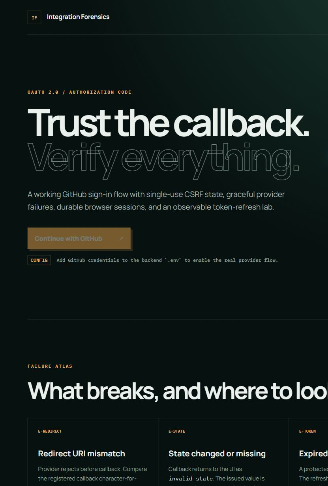
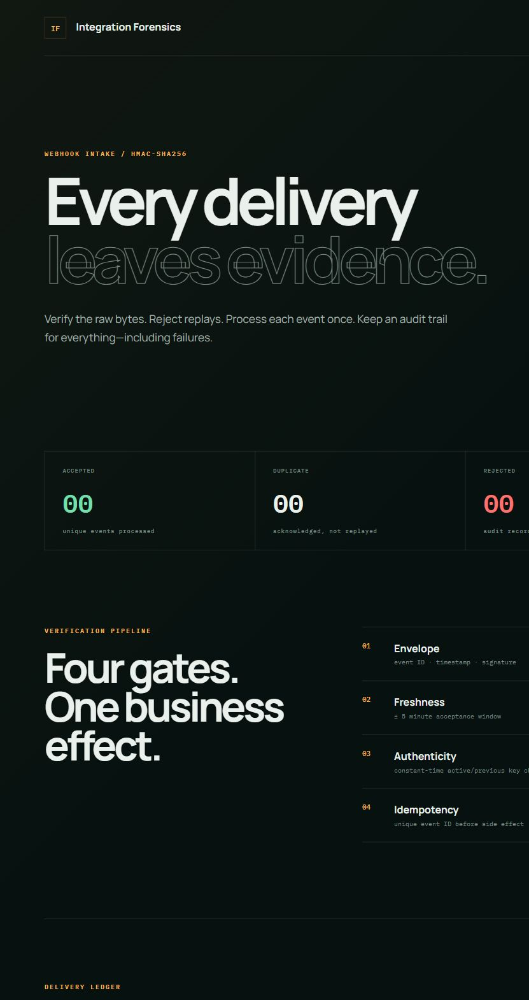
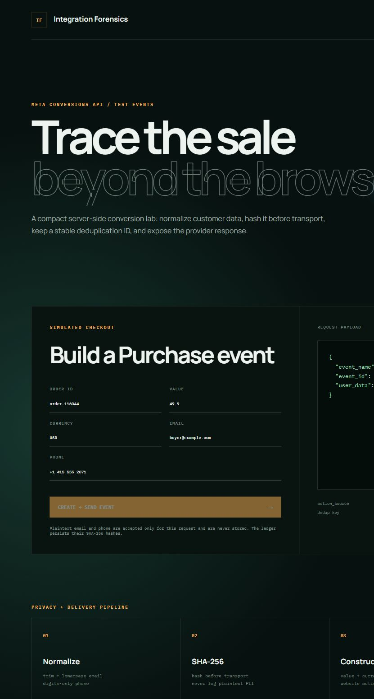
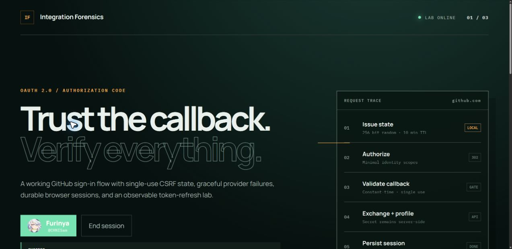
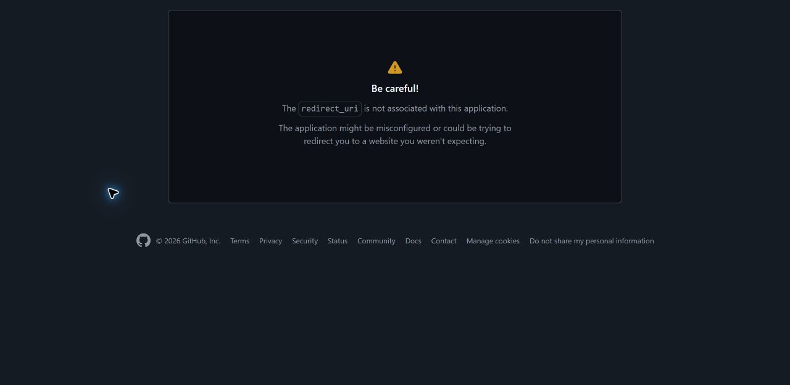

# API Integration Playground

Three runnable integration labs focused on the failure modes that make OAuth, webhooks, and server-side conversion tracking difficult in real projects.

> Backend/API integration developer with one year of hands-on full-stack experience, focused on OAuth, webhooks, and third-party APIs.

## Projects

| Project | What it demonstrates | Status |
| --- | --- | --- |
| [OAuth Flow Demo](oauth-flow-demo/) | Authorization code flow, CSRF state validation, provider errors, durable sessions, and refresh-token handling | Ready; real GitHub flow verified 2026-08-05 |
| [Webhook HMAC Guard](webhook-hmac-guard/) | Constant-time HMAC verification, replay windows, idempotency, and rejection audit trails | Ready and fully testable locally |
| [Meta CAPI Harness](meta-capi-harness/) | PII normalization/hashing, event construction, deduplication IDs, and Meta Test Events delivery | Ready; real Test Events proof needs local credentials |

## Technology


Each subproject is an independent monolith with its own setup, database, tests, troubleshooting guide, and evidence checklist. Run all backend tests with:

```bash
mvn test
```

No real credentials belong in this repository. Copy the relevant `.env.example` to `.env` locally before testing a real provider.

## Interface previews

| OAuth flow | Webhook guard | Meta CAPI |
| --- | --- | --- |
| [](oauth-flow-demo/) | [](webhook-hmac-guard/) | [](meta-capi-harness/) |

These screenshots prove the local interfaces render; they are not presented as evidence that GitHub or Meta accepted an external request. Provider evidence must be captured with the operator's own local credentials.

## Provider evidence

| GitHub OAuth success | GitHub redirect mismatch |
| --- | --- |
| [](docs/screenshots/oauth-real-login.png) | [](docs/screenshots/oauth-redirect-uri-error.png) |

The GitHub screenshots were captured from a real authorization attempt on 2026-08-05 using local, ignored credentials. Meta Test Events remains credential-dependent and has not been represented as externally verified.
