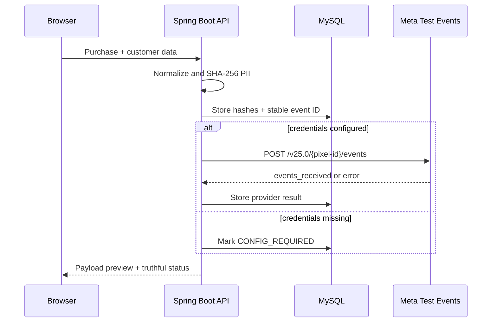

# Meta Conversions API Harness


A Spring Boot and Vue lab that builds privacy-safe `Purchase` events, sends them to Meta Test Events when locally configured, and preserves an inspectable delivery ledger.

## What it proves

- Email is trimmed/lowercased and phone numbers are reduced to digits before SHA-256 hashing.
- `event_name`, Unix `event_time`, `action_source`, `event_id`, `value`, and `currency` are explicit in the outgoing payload.
- The order ID is a stable `event_id`; resending keeps it unchanged for browser/server or retry deduplication.
- External success is never simulated. Without all three Meta settings, the event is marked `CONFIG_REQUIRED` and no HTTP call occurs.
- Plaintext email, phone, and the access token are never persisted or returned by ledger endpoints.



`action_source` is `website` because the UI represents a website checkout. `test_event_code` is supplied at the request envelope level so delivery appears in Events Manager's Test Events tab.

## Run

1. Copy `.env.example` to `.env`.
2. In Events Manager, open the pixel's **Test Events** view and copy its test event code.
3. Add a pixel ID, access token, and test event code only to the local `.env`.
4. Start the independent monolith:

```powershell
docker compose up --build
```

Open `http://localhost:5175`, submit a purchase, confirm `SENT`, and verify the matching `event_id` in Meta Test Events. The UI works in payload-preview mode without credentials, but that mode is not evidence of external delivery.

For development without Docker, run MySQL on port 3309, then start `mvn spring-boot:run` in `backend` and `npm run dev` in `frontend`.

## Common failure modes

### CONFIG_REQUIRED

- **Cause:** pixel ID, access token, or test event code is empty.
- **Fix:** populate the local `.env` and restart. Do not commit it.

### Meta returns 400

- **Cause:** an expired/invalid token, wrong pixel, malformed data, unsupported currency, or event time outside the accepted window.
- **Fix:** inspect the ledger's provider response, verify Events Manager settings, and generate a fresh event. Do not hide the provider error behind a local success response.

### Event does not appear under Test Events

- **Cause:** wrong test event code, looking at a different dataset/pixel, or sending a production event without the code.
- **Fix:** copy the current code from the exact pixel's Test Events view and confirm the configured pixel ID.

### Duplicate conversion

- **Cause:** Pixel and CAPI used different `event_id` values, or the retry generated a new ID.
- **Fix:** reuse the order ID across browser and server events. The **same ID** button demonstrates a retry without changing the deduplication key.

### Low event match quality

- **Cause:** inconsistent normalization or too few customer matching fields.
- **Fix:** validate normalization against Meta guidance and add legitimate first-party fields only with appropriate consent. Never add invented data.

## Tests

```bash
mvn test
```

The tests cover deterministic PII normalization/hashing, required Purchase fields, the no-credentials safety path, external gateway use, and stable IDs across resends. A real Meta acceptance screenshot requires credentials and must come from a genuine Test Events response.

## Evidence status

- Local event construction, hashing, credential-gating, gateway, and resend behavior: covered by automated tests.
- Vue production build: automated.
- Real Meta Test Events acceptance: not verified as of 2026-08-05 because no authenticated Meta Events Manager dataset, pixel token, and test event code were available. No dashboard or success response has been fabricated.
