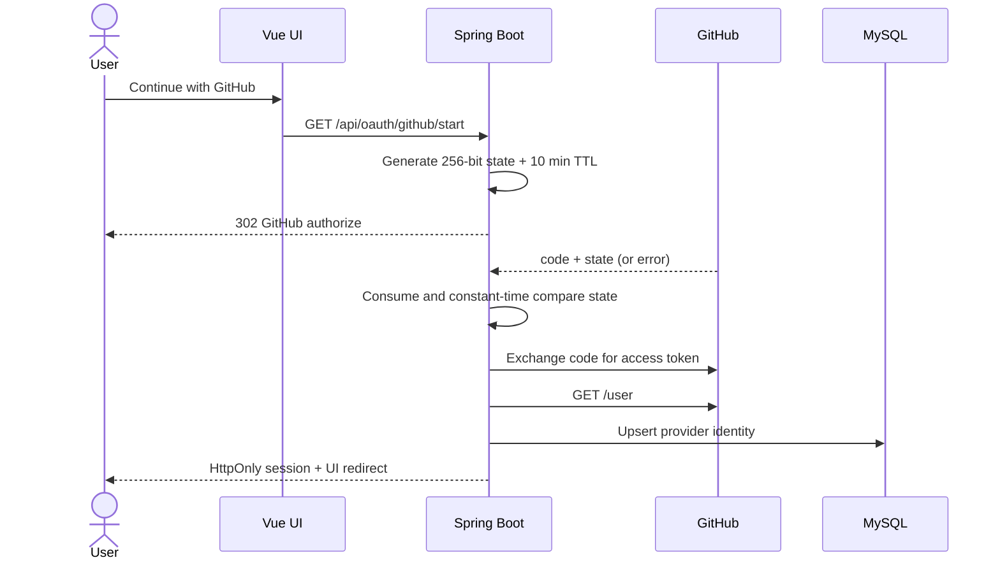

# OAuth Flow Demo

A forensic OAuth 2.0 Authorization Code Flow lab: real GitHub sign-in, single-use `state` validation, provider-error handling, a durable HttpOnly session, and a controlled refresh-token experiment.

## Why this exists

OAuth failures often look like “login just bounced back” even though the cause sits at a precise boundary: provider registration, callback integrity, token exchange, or session creation. This project makes those boundaries visible and testable.

## Architecture



The GitHub client secret and access token never cross the backend boundary. The database stores the provider identity and profile, not the GitHub access token.

## Run locally

1. Create a GitHub OAuth App under **Settings → Developer settings → OAuth Apps**.
2. Use `http://localhost:5173` as the homepage and `http://localhost:8081/api/oauth/github/callback` as the callback.
3. Copy `.env.example` to `.env` and add the client ID and secret.
4. Start the independent stack:

```bash
docker compose up --build
```

Open `http://localhost:5173`. The UI remains explorable without credentials, but the real GitHub button stays disabled until the backend is configured.

Without Docker, start MySQL on port 3307, run `mvn spring-boot:run` from `backend/`, then `npm install && npm run dev` from `frontend/`.

## Refresh-token lab

GitHub OAuth App access tokens do not provide the conventional refresh-token flow required by the project exercise. The UI therefore labels and runs a separate local provider experiment:

1. Seed an expired access token with a refresh token.
2. Request the protected resource.
3. Detect expiry, exchange the refresh token, persist the replacement, and return the resource.

This demonstrates the algorithm without falsely claiming GitHub issued the refresh token.

## Common failure modes

### Redirect URI mismatch

- **Symptom:** GitHub rejects the authorization request or the callback never reaches the backend.
- **Cause:** the registered callback and `GITHUB_REDIRECT_URI` differ by scheme, host, port, path, or trailing slash.
- **Fix:** compare both values character-for-character; keep `http://localhost:8081/api/oauth/github/callback` for the default setup.

### State is missing, expired, or changed

- **Symptom:** the UI returns with `oauth=invalid_state` and no session is created.
- **Cause:** the callback is not paired with the browser session that initiated it, the 10-minute window elapsed, or the value was tampered with.
- **Fix:** keep cookies enabled, start a fresh login, and never reuse a captured callback. State is consumed on the first validation attempt, including failures.

### Access token expired

- **Symptom:** a provider API call returns 401.
- **Cause:** the client reused an expired access token without consulting its expiry metadata.
- **Fix:** run the refresh-token lab to observe the correct “check → refresh → replace → retry” path. For providers without refresh tokens, re-authorize instead.

### User denied authorization

- **Symptom:** GitHub returns an `error` parameter rather than a code.
- **Cause:** the user selected cancel or the provider denied the request.
- **Fix:** treat denial as a normal branch. This app redirects to a clear UI message and does not expose a 500 page.

## Tests

```bash
mvn test
```

Current focused coverage includes valid state, tampered/missing state, expired state, single-use state, valid token reuse, and expired token refresh.

## Evidence status

- Local backend unit tests: automated.
- Vue production build: automated.
- Real GitHub authorization and redirect-mismatch screenshot: requires a local OAuth App credential and is intentionally not fabricated or committed.
