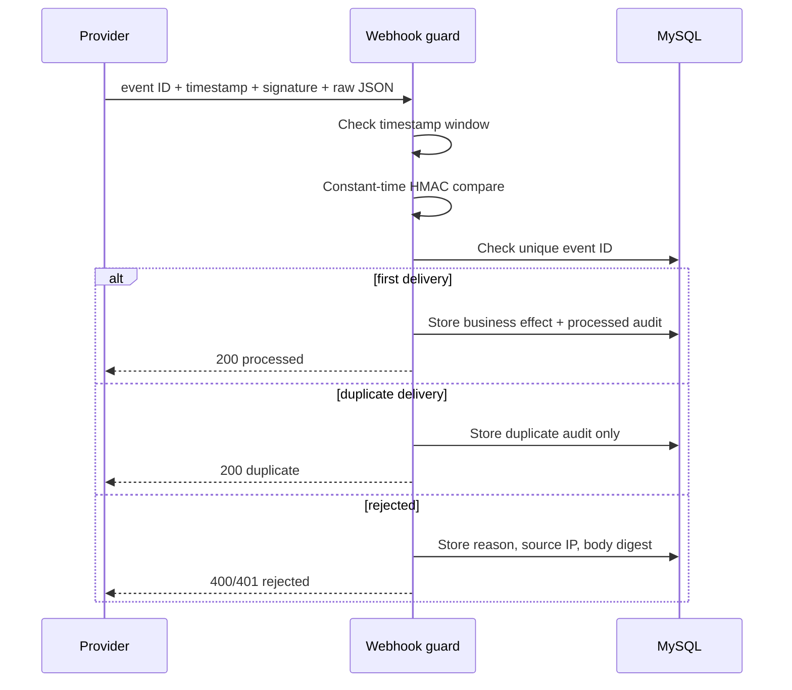

# Webhook HMAC Guard


A generic Spring Boot webhook receiver with HMAC-SHA256 authentication, a five-minute replay window, idempotent business processing, key rotation, and a delivery audit ledger.

## Request contract

| Header | Purpose |
| --- | --- |
| `X-Event-Id` | unique idempotency key |
| `X-Timestamp` | Unix seconds included in the signed payload |
| `X-Signature-256` | `sha256=<hex HMAC of timestamp.rawBody>` |



Only a SHA-256 body digest is persisted in the delivery ledger; the raw payload is not stored.

## Run

```powershell
Copy-Item .env.example .env
docker compose up --build
./scripts/send-webhook.ps1 -Mode valid
./scripts/send-webhook.ps1 -Mode valid -Duplicate
./scripts/send-webhook.ps1 -Mode bad-signature
./scripts/send-webhook.ps1 -Mode expired
```

Open `http://localhost:5174` to inspect the delivery ledger. All four commands are safe local simulations; no Stripe, Twilio, or GitHub account is required.

## Copyable curl shape

The signature must be computed from the exact raw bytes sent. PowerShell users can run the tested script above. The equivalent HTTP request is:

```bash
curl -X POST http://localhost:8082/webhook/receive \
  -H 'Content-Type: application/json' \
  -H 'X-Event-Id: evt-1001' \
  -H 'X-Timestamp: 1722816000' \
  -H 'X-Signature-256: sha256=<computed-hmac>' \
  --data-binary '{"type":"invoice.paid","amount":4900,"currency":"USD"}'
```

## Common failure modes

### Signature mismatch or missing

- **Symptom:** `401 {"status":"rejected","reason":"invalid signature"}`.
- **Cause:** wrong key, missing header, changed whitespace/body bytes, or signing only the body instead of `timestamp.body`.
- **Fix:** capture raw bytes before JSON parsing and compute HMAC-SHA256 over the documented canonical input.

### Timestamp expired

- **Symptom:** 401 even when the signature was once valid.
- **Cause:** a replayed delivery sits outside the ±5 minute window or the sender clock is wrong.
- **Fix:** synchronize clocks and sign a fresh Unix timestamp. Never widen the window simply to hide clock problems.

### Duplicate delivery

- **Symptom:** the second request returns 200 with `duplicate`, but the business side effect does not repeat.
- **Cause:** providers retry on slow/lost responses; duplicate delivery is normal.
- **Fix:** persist the provider event ID under a unique constraint and acknowledge duplicates successfully.

### Key rotation

Set a new `WEBHOOK_SECRET` and retain the outgoing value temporarily in `WEBHOOK_PREVIOUS_SECRET`. The ledger records whether `ACTIVE` or `PREVIOUS` matched. Remove the old key after the provider rollout window; do not keep both indefinitely.

Real Stripe/Twilio integrations should use each provider's official signature library and canonicalization rules while keeping the same freshness, audit, and idempotency structure.

## Tests

```bash
mvn test
```

Coverage includes correct active and previous keys, wrong/missing/body-mismatched signatures, fresh/expired/future/malformed timestamps, first processing, and duplicate skipping.
